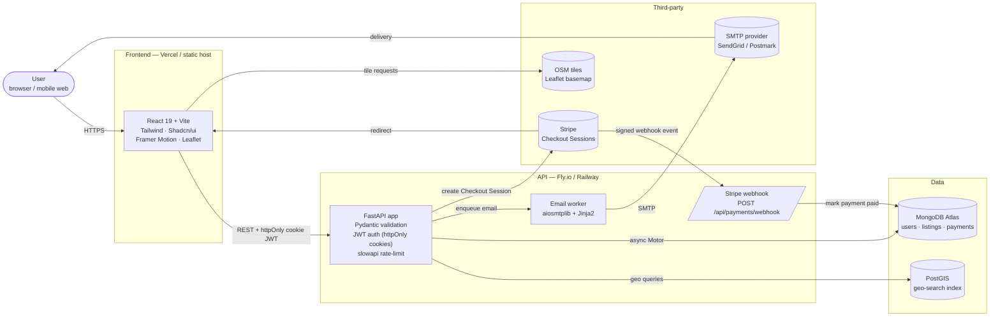
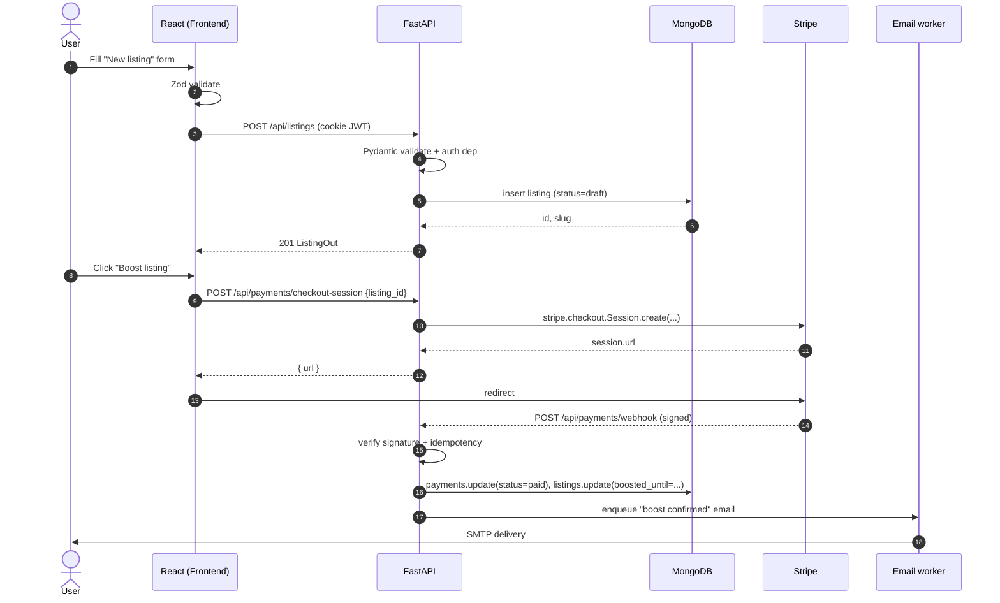
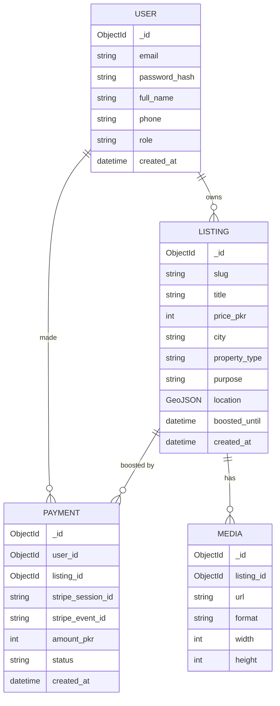

# Hils Marketing — Architecture

This document is the **single source of truth** for how the system is built and how data flows through it. Every new module must update this file (diagram + responsibility row).

---

## 1. System diagram

---

## 2. Component responsibilities

| Component | Responsibility | Owns |
|-----------|----------------|------|
| **User browser** | Renders the app, holds httpOnly cookie. | Nothing server-side. |
| **Frontend (React 19 + Vite)** | UI, routing, form validation (Zod), API calls, Stripe.js redirect, Leaflet map. | UX state, optimistic updates. |
| **FastAPI app** | HTTP layer: Pydantic validation, auth, business logic, persistence orchestration. | All write paths. |
| **Stripe webhook handler** | Verifies signed events and reconciles payment status idempotently (keyed by `event.id`). | `payments` collection updates. |
| **Email worker** | Async SMTP delivery via `aiosmtplib`, Jinja2-rendered templates. | Transactional email log. |
| **MongoDB (Motor)** | Primary store: `users`, `listings`, `payments`, `sessions`, `email_log`. | Document state. |
| **PostGIS** | Geo index for listing search (radius / polygon). | `listings_geo` table mirrors a subset of listing fields. |
| **Stripe** | Hosted Checkout — we never see card data. | Charges, customers, subscriptions. |
| **SMTP provider** | Outbound email delivery + reputation. | Delivery, bounces. |
| **OSM tiles** | Leaflet basemap. | Map imagery. |

---

## 3. Request flow — typical "create listing + boost payment"

---

## 4. API contract overview

All endpoints are prefixed `/api`. Full request/response shapes live in [`./api-reference.md`](./api-reference.md). Conventions:

- **Auth**: httpOnly cookies (`access_token`, `refresh_token`). Browser sends them automatically; the frontend sets `credentials: 'include'`.
- **Errors**: JSON `{ "detail": "..." }`, HTTP status describes the class (`400` validation, `401` unauth, `403` forbidden, `404` missing, `409` conflict, `429` rate-limited, `500` server).
- **Pagination**: `?page=1&page_size=20`. Responses include `{ items, total, page, page_size }`.
- **Versioning**: not yet — single version. When we break compatibility we move to `/api/v2/...`.

| Group | Base path | Notes |
|-------|-----------|-------|
| Auth | `/api/auth` | Rate-limited (5 / 15 min / IP) |
| Users | `/api/users` | `me` endpoints first |
| Listings | `/api/listings` | Public read, auth-only write |
| Payments | `/api/payments` | Stripe-only |
| Media | `/api/media` | Signed upload URLs |

---

## 5. Security model (summary)

Detailed rules live in [`./security.md`](./security.md). Highlights:

- **Passwords**: bcrypt via `passlib`.
- **JWT**: access 12 h, refresh 7 d, both httpOnly + Secure + SameSite=Lax cookies. Refresh token rotates on every refresh.
- **Stripe**: only Checkout Sessions — no raw card data ever touches our servers. Webhooks verified with `STRIPE_WEBHOOK_SECRET`, handlers are idempotent on `event.id`.
- **Rate limiting**: `/auth/*` capped at 5 attempts / 15 min / IP via `slowapi`.
- **CORS**: origins from `CORS_ORIGINS` env, **never `*`** in production.
- **Logging**: never log passwords, tokens, or PII. Tokens are masked to first 6 chars if logged at all.
- **Secrets**: `.env` files only, validated at startup via `pydantic-settings`.

---

## 6. Data model (high level)

---

## 7. Deployment topology (target)

| Layer | Where | Notes |
|-------|-------|-------|
| Frontend | Vercel | Static build from `frontend/`. Env via Vercel dashboard. |
| API | Fly.io or Railway | Single FastAPI service, autoscaling 1–N instances. |
| MongoDB | Atlas (shared M0 → M10) | Region: `ap-south-1` (closest to PK). |
| PostGIS | Managed Postgres (Neon / Supabase) | Only for `listings_geo`. |
| Email | SendGrid or Postmark | API key in env. |
| Stripe | Stripe-hosted Checkout | Webhook endpoint registered in dashboard. |
| Media (future) | Cloudflare R2 / S3 | Signed upload URLs from `/api/media`. |

See [`./deployment.md`](./deployment.md) for the actual deploy steps.
