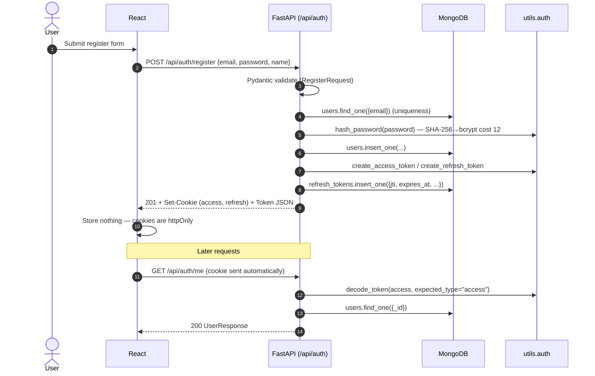

# Authentication

This document describes the **end-to-end authentication flow** for the Hils Marketing platform, the security guarantees we make, and how to operate the feature in dev and prod.

> **Module**: `backend/routes/auth.py` · **Models**: `backend/models/auth.py`, `backend/models/user.py` · **Helpers**: `backend/utils/{auth,cookies,db,security}.py`

---

## 1. Diagram — register / login round trip



---

## 2. Endpoint catalogue

| Method | Path | Auth | Body | Success | Failure modes |
|--------|------|------|------|---------|----------------|
| POST | `/api/auth/register` | — | `RegisterRequest` | `201 Token` + Set-Cookie | `409` email taken · `422` validation |
| POST | `/api/auth/login` | — | `LoginRequest` | `200 Token` + Set-Cookie | `401` invalid · `429` locked |
| POST | `/api/auth/logout` | optional refresh cookie | — | `204` | always 204 |
| GET | `/api/auth/me` | access (cookie or Bearer) | — | `200 UserResponse` | `401` |
| POST | `/api/auth/forgot-password` | — | `ForgotPasswordRequest` | `204` (always) | `422` validation |
| POST | `/api/auth/reset-password` | — | `ResetPasswordRequest` | `204` | `400` bad/expired/used · `422` |

Full request/response shapes also live in [`./api-reference.md`](./api-reference.md).

---

## 3. Security model — what we guarantee

### Passwords

- **Hashed with bcrypt** (cost factor 12, `bcrypt==4.2.1`) — see `backend/utils/auth.py::hash_password`.
- A SHA-256 pre-hash step sidesteps bcrypt's 72-byte input limit, so users with long passphrases work without surprises.
- **Constant-time verification** via `bcrypt.checkpw` resists timing attacks. The login endpoint also returns a single generic error (`"Invalid email or password"`) whether the email is missing OR the password is wrong — no account enumeration via response shape.

### JWTs

| Token | TTL | Cookie path | Claims |
|-------|-----|-------------|--------|
| `access_token` | 12 h (env: `JWT_ACCESS_TOKEN_HOURS`) | `/` | `sub`, `iat`, `exp`, `jti`, `type="access"` |
| `refresh_token` | 7 d (env: `JWT_REFRESH_TOKEN_DAYS`) | `/api/auth` | `sub`, `iat`, `exp`, `jti`, `type="refresh"` |

- Algorithm: **HS256** with `JWT_SECRET` (≥ 32 random bytes — `openssl rand -hex 32`).
- The `type` claim makes a stolen access token unusable on the refresh endpoint (and vice versa).
- Each refresh token has a **unique `jti`** stored in `refresh_tokens`. Logout sets `revoked_at`; password reset revokes them all (`revoked_at`) so a stolen token can't outlive the reset.

### Cookies

```
Set-Cookie: access_token=...;  HttpOnly; Secure?; SameSite=Lax; Path=/;          Max-Age=43200
Set-Cookie: refresh_token=...; HttpOnly; Secure?; SameSite=Lax; Path=/api/auth;  Max-Age=604800
```

- `HttpOnly` — JavaScript cannot read the cookie, neutralising XSS-based token theft.
- `Secure` — only sent over HTTPS in prod (env: `COOKIE_SECURE`). Dropped in dev for HTTP localhost.
- `SameSite` — see §5 below for the policy trade-off (`lax` vs `none`).
- `Path` — refresh cookie is **only** sent to `/api/auth`, so XSS on `/api/listings` can't smuggle it back to us via image src tricks.

### Rate limiting — per-(IP, email) lockout

The `/login` endpoint tracks failures in MongoDB:

```js
// login_attempts (TTL index on updated_at — 1 hour)
{
  _id: "203.0.113.5:user@hils.pk",   // ip:email — both lowered
  attempts: 3,
  locked_until: ISODate(...) | null,
  created_at: ..., updated_at: ...,
}
```

- After **5** failures the pair is locked for **15 minutes** (constants in `routes/auth.py`).
- Successful login deletes the row immediately, so a legitimate user is never penalised for one misspelled password.
- TTL of 1 hour on `updated_at` ensures abandoned attempt records auto-delete.

**Trade-off**: pairing IP+email means an attacker can rotate IPs to bypass the lockout. We accept this because the alternative (per-email-only) lets an attacker lock any user out of their account by spamming bad passwords. A future hardening could add an IP-only secondary throttle.

### Forgot password — no account enumeration

`POST /api/auth/forgot-password` always returns `204`, regardless of whether the email exists. Internally:

- If the email matches a user, generate `secrets.token_urlsafe(48)` (64 chars, ~288 bits of entropy).
- Store only the **SHA-256 hash** of the token in `password_reset_tokens`. Even a full DB exfiltration won't let an attacker reset anyone's password.
- TTL: 1 hour (env: `RESET_TOKEN_TTL_MINUTES`).

In **development**, the plaintext token is logged to stdout:

```
WARNING  hils.auth  DEV ONLY — password reset token for test@hils.pk: <token> (expires 2026-05-17T13:42:19+00:00)
```

In **production** (`APP_ENV=production`), only a hashed-email breadcrumb is logged — email delivery is handled by `utils/email.py` (lands in the email feature prompt).

`POST /api/auth/reset-password` verifies the token is unused + unexpired, hashes the new password, **revokes all existing refresh tokens** for the user, and marks the reset token used. One-and-done.

---

## 4. Mongo collections + indexes

| Collection | Purpose | Indexes |
|------------|---------|---------|
| `users` | Account records | `email` unique |
| `refresh_tokens` | Issued refresh tokens (for revocation) | `jti` unique · `expires_at` TTL=0 |
| `login_attempts` | Failed-login counters | `updated_at` TTL=3600s |
| `password_reset_tokens` | Reset token hashes | `token_hash` unique · `expires_at` TTL=0 |

Indexes are created in `server.py::_ensure_indexes` on startup (idempotent — safe to redeploy).

---

## 5. SameSite policy — when to use `Lax` vs `None`

- **`Lax` (default)** — fine when frontend and API share a registrable domain (`hils.pk` + `api.hils.pk`). Works with browser back-button navigation; only blocks cookies on cross-site POSTs (CSRF defence-in-depth).
- **`None`** — required when the frontend lives on a totally different registrable domain than the API (e.g. `hils.pk` + `api.somewhere.dev`). Browsers force `Secure=true` in this mode, so dev over HTTP localhost won't work.
- **`Strict`** — also valid, but breaks OAuth-style redirects and any cross-site UX. Use only if you have no third-party integrations.

Set via `COOKIE_SAMESITE` env (`lax` / `strict` / `none`).

---

## 6. Local-dev quick test

### Windows (PowerShell) — use JSON files, not inline `-d`

PowerShell breaks inline JSON (`'{\"email\":...}'` truncates the body). Use the fixture files in `backend/`:

| File | Endpoint |
|------|----------|
| `register.json` | `POST /api/auth/register` — `email`, `password`, **`name`** |
| `login.json` | `POST /api/auth/login` — **`email`, `password` only** (no `name`) |
| `forgot-password.json` | `POST /api/auth/forgot-password` — `email` only |

```powershell
cd backend
.venv\Scripts\activate
uvicorn server:app --reload --port 8000

# Register
curl.exe -X POST "http://localhost:8000/api/auth/register" `
  -H "Content-Type: application/json" -d "@register.json" -c cookies.txt

# Login — must use login.json, NOT register.json
curl.exe -X POST "http://localhost:8000/api/auth/login" `
  -H "Content-Type: application/json" -d "@login.json" -c cookies.txt -b cookies.txt

curl.exe "http://localhost:8000/api/auth/me" -b cookies.txt

# Logout (-c updates the jar with cleared cookies)
curl.exe -X POST "http://localhost:8000/api/auth/logout" -b cookies.txt -c cookies.txt -v
curl.exe "http://localhost:8000/api/auth/me" -b cookies.txt   # expect 401

# Forgot password (token printed in uvicorn stdout when APP_ENV=development)
curl.exe -X POST "http://localhost:8000/api/auth/forgot-password" `
  -H "Content-Type: application/json" -d "@forgot-password.json"
```

### Unix / macOS

```bash
cd backend
source .venv/bin/activate
uvicorn server:app --reload --port 8000

curl -X POST http://localhost:8000/api/auth/register \
  -H 'Content-Type: application/json' \
  -c cookies.txt \
  -d '{"email":"test@hils.pk","password":"Test@123","name":"Test User"}'

curl -X POST http://localhost:8000/api/auth/login \
  -H 'Content-Type: application/json' \
  -c cookies.txt -b cookies.txt \
  -d '{"email":"test@hils.pk","password":"Test@123"}'

curl http://localhost:8000/api/auth/me -b cookies.txt
```

Expected: `register` returns 201 + JSON `{access_token, refresh_token, ...}` and writes two cookies. `login` does the same on subsequent calls. `me` returns the user document without `password_hash`.

### Trigger the lockout

```bash
for i in 1 2 3 4 5 6; do
  echo "attempt $i:"
  curl -s -o /dev/null -w "%{http_code}\n" \
    -X POST http://localhost:8000/api/auth/login \
    -H 'Content-Type: application/json' \
    -d '{"email":"test@hils.pk","password":"wrong"}'
done
```

Expected: five `401`s, then `429` until the 15-minute window elapses.

### Forgot / reset

```bash
curl -X POST http://localhost:8000/api/auth/forgot-password \
  -H 'Content-Type: application/json' \
  -d '{"email":"test@hils.pk"}'
# Look at the uvicorn stdout for: "DEV ONLY — password reset token ... <TOKEN>"

curl -X POST http://localhost:8000/api/auth/reset-password \
  -H 'Content-Type: application/json' \
  -d "{\"token\":\"<TOKEN>\",\"new_password\":\"NewerPass!1\"}"
```

---

## 7. Production checklist

- [ ] `JWT_SECRET` set to a fresh ≥ 32-byte hex (not the dev value).
- [ ] `COOKIE_SECURE=true`, `APP_ENV=production`.
- [ ] `COOKIE_SAMESITE` set to `lax` (same-origin) or `none` (cross-origin) per topology.
- [ ] `COOKIE_DOMAIN` set if cookies must span subdomains.
- [ ] `TRUST_PROXY_HEADERS=true` if the API sits behind a known reverse proxy.
- [ ] `RESET_TOKEN_TTL_MINUTES` reviewed for your support workflow.
- [ ] SMTP wired (separate email feature prompt) so reset tokens are delivered, not just logged.
- [ ] Mongo `users.email` index visible in Atlas — `db.users.getIndexes()`.

---

## 8. Frontend pages (`auth-002`)

| Route | File | Notes |
|-------|------|-------|
| `/login` | `frontend/src/pages/Login.jsx` | Email + password, "Forgot password?" link, Google placeholder (disabled). |
| `/signup` | `frontend/src/pages/Signup.jsx` | Name + email + **+92 phone** + password + terms checkbox + live strength bar. |
| `/forgot-password` | `frontend/src/pages/ForgotPassword.jsx` | Single email field; always renders neutral success message after submit (anti-enumeration). |
| `/reset-password?token=...` | `frontend/src/pages/ResetPassword.jsx` | Reads token from query; new password + confirm with cross-field match check; auto-redirects to `/login` after 1.5 s on success. |

### Shared building blocks

- **`src/lib/api.js`** — axios instance with `withCredentials: true` so the httpOnly access/refresh cookies flow on every request. Exports `extractError(err)` to convert Pydantic 422 (`detail: [{loc, msg}]`) into a per-field map and HTTPException (`detail: string`) into a banner message.
- **`src/lib/passwordStrength.js`** — pure function returning `0..4` based on length and character classes; **never gates submission** (Zod's `min(8)` is the hard floor).
- **`src/components/ui/Input.jsx`** — labelled input with the dark-luxury surface treatment (`bg-[#0A0A0A]`, `border-white/10`, gold focus). Forwards refs for `react-hook-form` and wires `aria-invalid` / `aria-describedby` automatically.
- **`src/components/ui/PasswordStrength.jsx`** — four-segment gold bar driven by `scorePassword(value)`.

### Validation rules (Zod → matches backend)

| Field | Rule | Server mirror |
|-------|------|---------------|
| `email` | `z.string().email()` | `EmailStr` |
| `password` | `z.string().min(8)` | `min_length=8` |
| `name` (signup) | `min(2).max(120)` | `min_length=2, max_length=120` |
| `phone` (signup) | `/^(?:\+?92\|0)3\d{9}$/` | `PK_PHONE_PATTERN` (optional on the API; required in the UI) |
| `acceptTerms` (signup) | `z.literal(true)` | n/a — UX gate only |
| `confirm` (reset) | `refine(...)` matches `password` | n/a — UX gate only |

### UX contract

- **Submit-disable while pending** — `formState.isSubmitting` flips the button and swaps the label to `Signing in…` / `Creating account…` / `Updating…`.
- **Banner + per-field errors** — top-level submit error from the server lives in a red banner with `role="alert"`; Pydantic field errors are merged back into RHF via `setError` so they land under the correct input.
- **Motion budget** — page section fades + lifts 12 px on mount (`duration: 0.32 s`); buttons use the shared `<Button>` micro-interactions. Everything is gated on `usePrefersReducedMotion()`.
- **Mobile** — single column, full-width inputs (`w-full`), `max-w-md` container.

### Test IDs cheatsheet

| Page | Pattern |
|------|---------|
| Login | `login-{email,password}-input`, `login-{submit,google}-button`, `login-{forgot,signup}-link`, `login-error`, `login-page` |
| Signup | `signup-{name,email,phone,password}-input`, `signup-password-strength{,-label}`, `signup-terms-{checkbox,error}`, `signup-{submit,google}-button`, `signup-login-link`, `signup-error`, `signup-page` |
| Forgot | `forgot-email-input`, `forgot-submit-button`, `forgot-error`, `forgot-{back,back-to-login}-link`, `forgot-success`, `forgot-password-page` |
| Reset | `reset-{password,confirm}-input`, `reset-password-strength{,-label}`, `reset-submit-button`, `reset-error`, `reset-{back,success-login}-link`, `reset-missing-token`, `reset-success`, `reset-password-page` |

### Local smoke test

```powershell
cd frontend
npm install         # picks up react-hook-form + @hookform/resolvers
npm run dev
# Browser → http://localhost:5173/signup → submit → should redirect to /dashboard
# Browser → http://localhost:5173/login    → submit → should redirect to /dashboard
# Browser → http://localhost:5173/forgot-password → success panel
# Backend uvicorn stdout prints "DEV ONLY — password reset token ... <TOKEN>"
# Browser → http://localhost:5173/reset-password?token=<TOKEN> → updates password
```

---

## 9. Future work

- `/api/auth/refresh` endpoint with refresh-token rotation + reuse-detection.
- Generic IP-based `slowapi` limiter on **all** `/auth/*` routes (defence in depth on top of per-IP+email).
- HIBP integration — reject passwords found in the top-100k breached list.
- Email delivery for password reset (replaces the stdout log).
- Account lockout email notification ("we saw 5 failed logins from a new location").
- Real "Continue with Google" OAuth provider (currently a disabled placeholder).
- `AuthContext` / `useAuth` hook backed by `/me`, plus a `<RequireAuth>` route guard around `/dashboard` and `/admin`.
